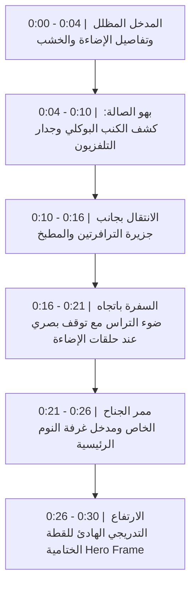

# خطة التنفيذ المعتمدة: الجولة المعمارية السينمائية المتصلة (Cinematic Architectural Flythrough) + التطوير الواقعي للخامات

بناءً على التوجيهات الدقيقة والملاحظات المعمارية الاحترافية، تم تحويل التوجه من أسلوب الـ FPV السريع إلى **جولة طيران معمارية سينمائية متصلة وهادئة (Cinematic Flythrough)** تبرز فخامة الفراغ والمواد باتزان ورزانة بصرية، مع ضبط مواصفات الخامات فيزيائياً بدون مبالغات رقمية.

---

## 1. مبادئ مسار الكاميرا وحركتها (Camera Trajectory & Kinematics)

- **طبيعة الحركة:** طيران سلس وثابت يحاكي درون سينمائي مع وسائد تسارع وتباطؤ طبيعية (Smooth Ease-in / Ease-out)، مع ميلان جانبي طفيف جداً (**Banking لا يتجاوز 3–5 درجات**) في المنعطفات الكبيرة فقط.
- **الارتفاع الآمن:** الحفاظ على ارتفاع الكاميرا بين **1.35م و1.60م** مع تغييرات ارتفاع تدريجية ومبررة معمارياً.
- **مسافة الأمان:** حد أدنى **35–50 سم** بين الكاميرا وأي سطح أو قطعة أثاث (تجنب الدوران الضيق حول الثريات أو التحليق الملاصق للأسطح).
- **العدسة والتأطير:** عدسة مكافئة **21–24mm** تحافظ على اتساع الفراغ دون تشويه حواف الصورة أو جعل المكان يبدو أصغر.
- **التوجيه البصري:** توجيه محور الكاميرا نحو نقاط ثقل معمارية (Architectural Focal Points) مع وقفات بصرية قصيرة تسمح للعين باستيعاب المواد والضوء.

---

## 2. التسلسل الزمني للجولة (30.0 ثانية @ 24fps = 720 إطاراً)

1. **0:00–0:04 (المدخل):** بداية من بهو المدخل المظلل مع إبراز تفصيلة خشبية وإضاءة خطية دافئة، ثم حركة تقدمية ناعمة.
2. **0:04–0:10 (الصالة والمعيشة):** كشف الكنب البوكلي مع السجادة وجدار التلفزيون الحجري بحركة انسيابية واسعة.
3. **0:10–0:16 (الجزيرة والمطبخ):** العبور بجانب جزيرة الترافرتين الإيطالية والواجهة الخشبية للمطبخ (مرور جانبي مريح ومستقيم نسبياً دون الدوران الحاد حول الثريا).
4. **0:16–0:21 (السفرة ومطل التراس):** التحرك بمحاذاة طاولة الطعام باتجاه الضوء الطبيعي للتراس، مع توقف بصري رشيق يبرز نقاء حلقات الإنارة البرونزية.
5. **0:21–0:26 (الممر الخاص وجناح النوم):** تحرك هادئ في الممر الخاص يكشف عتبة ومدخل غرفة النوم الرئيسية وتفاصيل السرير والخزائن المضاءة.
6. **0:26–0:30 (اللقطة الختامية الماستر):** العودة المنسابة إلى فراغ الصالة والارتفاع التدريجي المتزن لتأطير المشهد المعماري المتكامل في Hero Frame مهيب.

---

## 3. معايير فيزيائية دقيقة للخامات (No Plastic — Physically Plausible PBR)

نلغي أي وصفات رقمية مصطنعة ونعتمد المعايير الواقعية الصرفة:

- **قماش البوكلي (`Master_Boucle`):**
  - نسيج ميكروي (Micro-Fiber Weave) بحجم نسبي دقيق يطابق مقياس الكنب الحقيقي.
  - تفعيل Sheen حقيقي مع تباين طفيف في الخشونة (Roughness Variation: 0.75 - 0.85).
  - إزاحة ميكروية دقيقة جداً (Subtle Micro-Displacement).
  - **إلغاء تام للـ Subsurface Scattering (SSS)** لمنع أي مظهر شمعي.
- **خشب الجوز والروزوود (`Master_Walnut`):**
  - اتجاه العروق الطبيعي مطابق لكل لوح ودرفة رأسياً وأفقياً.
  - تفاوت طبيعي خفيف في درجات اللون بين الألواح المتجاورة لمنع النمطية.
  - مسام مجهرية حقيقية (Fine Pores Bump) وشطف حواف هندسي حقيقي (Bevel Modifier).
- **حجر الترافرتين (`Master_Travertine`):**
  - الحفاظ على طبيعة الحجر الرسوبي المسامي وتدرج عروقه الأصلية، مع ضبط الخشونة والانعكاس بما يطابق الحجر الطبيعي المعماري.
- **البرونز والذهب المصقول (`Master_Brushed_Bronze`):**
  - معدن حقيقي (Metallic 1.0) مع خريطة خشونة طولية مسحوبة (Directional Brushed Map) تتوافق مع اتجاه دوران الحلقات والثريات، وخدوش ناعمة جداً غير مشوشة.
- **البلاستر والجدران (`Master_Greige_Plaster`):**
  - بروز خفيف وناعم جداً يحاكي دهان البلاستر اليدوي بدون مبالغة، لكسر الانعكاسات البلاستيكية المسطحة.

---

## 4. الإضاءة والبيئة المعمارية (Balanced Lighting Strategy)

- **ضوء النهار الخارجي (Daylight):** 5600K يدخل من نوافذ التراس بانسياب ناعم.
- **الإضاءة الداخلية (Practicals & Strips):** حرارة دافئة فاخرة بين 2700K و3000K.
- **التباين الفوتوغرافي (Contrast):** الحفاظ على التفاصيل داخل النوافذ وفي مناطق الظلال دون سحقها (Crush) أو حرقها (Clipping).
- **الضباب والضبابية:** استخدام Motion Blur خفيف وطبيعي جداً (Shutter 180°)، مع استبعاد الـ Volumetrics الكثيفة للحفاظ على نقاء الرؤية.

---

## 5. خطة الإنتاج والتسليم (Production & Deliverables Pipeline)

1. **معاينة الحركة والسلامة (Path Preview):**
   - استخراج فيديو معاينة سريع (Path Preview) للتأكد من خلو المسار من أي Clipping أو اهتزازات، وثبات المسافات الآمنة والـ Banking الطفيف.
2. **فحص الخامات والإضاءة:**
   - رندرة فريمات تجريبية ثابتة بـ Cycles بمقاييس الخامات الدقيقة قبل إطلاق الرندر الكامل.
3. **الرندر الرئيسي (Master Quality):**
   - الرندر النهائي لجميع الفريمات بصيغة **OpenEXR 16-bit Half-Float** للحفاظ على كامل النطاق الديناميكي (Dynamic Range) للألوان والضوء.
4. **المونتاج والتلوين والتسليم:**
   - التجميع والتلوين الاحترافي، واستخراج نسخة الماستر العالية الجودة، تليها نسخة MP4 H.264/H.265 المصدرة بدقة لمنصات العرض والسوشيال.
